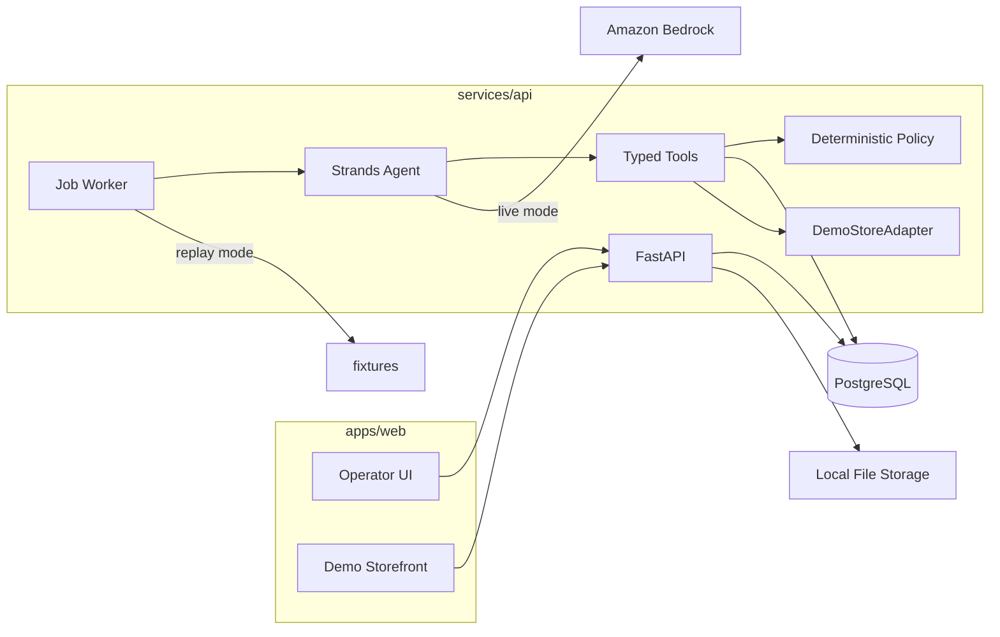

# Architecture

## Overview

ShelfReady is a single monorepo with one operator workspace:

- **Next.js** (`apps/web`) — operator workbench and demo storefront
- **FastAPI** (`services/api`) — authenticated API, Strands agent tools, persisted job worker
- **PostgreSQL** — application state (batches, products, versions, decisions, jobs, store, carts)
- **Local file storage** — images behind a storage interface

## Agent loop

1. Operator imports CSV (or loads fixtures) and starts a **persisted job**.
2. Worker claims the job (survives restart via DB status + checkpoint).
3. Deterministic preprocessing normalizes known aliases, validates money/stock, classifies fixture images, creates decision rows.
4. If pending decisions exist, job → `awaiting_decisions`.
5. After humans resolve the inbox, a **publish** job runs `publish_product` / `verify_published_product` tools.
6. In **live** mode, Strands + Bedrock may also call tools after preprocessing when no blockers remain.
7. In **replay** mode, the same tools/services run without a model.

## Policy enforcement

Approvals, SKU uniqueness, Decimal money, stock rules, and publication eligibility are enforced in Python (`app/policy`, `publish_product`), not only in prompts.

## Store adapter

`StoreAdapter` is the extension point for future Shopify/Medusa connectors. MVP implements `DemoStoreAdapter` only (same Postgres).
