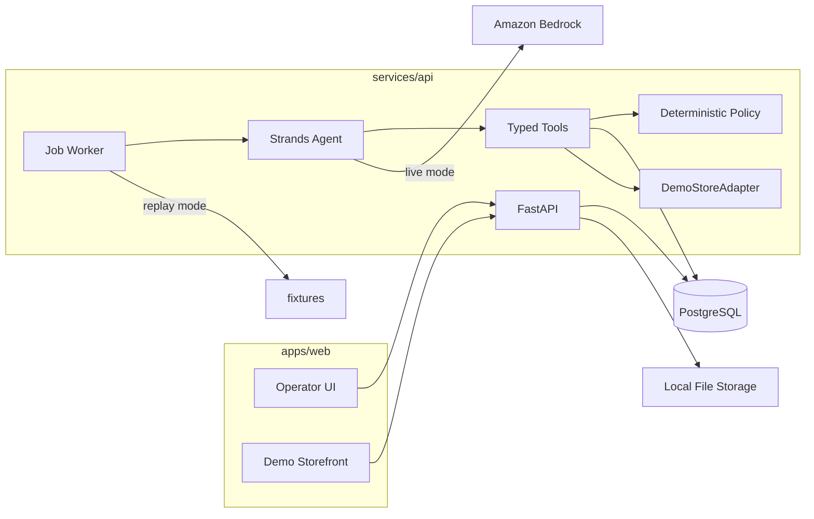

# Architecture

## Overview

ShelfReady is a single monorepo with one operator workspace:

- **Next.js** (`apps/web`) — operator workbench and demo storefront
- **FastAPI** (`services/api`) — authenticated API, Strands agent tools, persisted job worker
- **PostgreSQL** — application state (batches, products, versions, decisions, jobs, store, carts)
- **Local file storage** — images behind a storage interface

## Agent loop

1. Operator imports CSV (or loads fixtures) and starts a **persisted job**.
2. Worker claims the job (survives restart via DB status + checkpoint).
3. Deterministic preprocessing normalizes known aliases, validates money/stock, classifies fixture images, creates decision rows.
4. **Replay:** predetermined enrichment runs in `run_deterministic_processing(enrich=True)`.
5. **Live:** deterministic parse/validate runs without automatic lookup. Strands inspects each product, may call `lookup_product_identifier`, and returns `ProductAssessment` via `structured_output_model`. Application code validates evidence IDs and consumes the assessment.
6. If pending decisions exist, job → `awaiting_decisions`. Resolving a live-mode decision enqueues a **resume** job for that product only. The next Strands invocation reads the updated database row — the DB remains the source of truth (no competing agent session store).
7. After humans resolve blockers, a **publish** job runs `publish_product` / `verify_published_product`.
8. Verification checks store adapter retrieval, JSON-LD consistency, and cart add/block behavior (the same data path the demo storefront uses). It does not HTTP-crawl the Next.js pages.

## Policy enforcement

Approvals, SKU uniqueness, Decimal money, stock rules, and publication eligibility are enforced in Python (`app/policy`, `publish_product`), not only in prompts.

## Store adapter

`StoreAdapter` is the extension point for future Shopify/Medusa connectors. MVP implements `DemoStoreAdapter` only (same Postgres).
